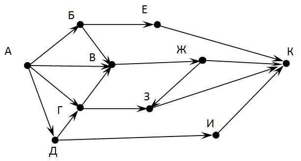
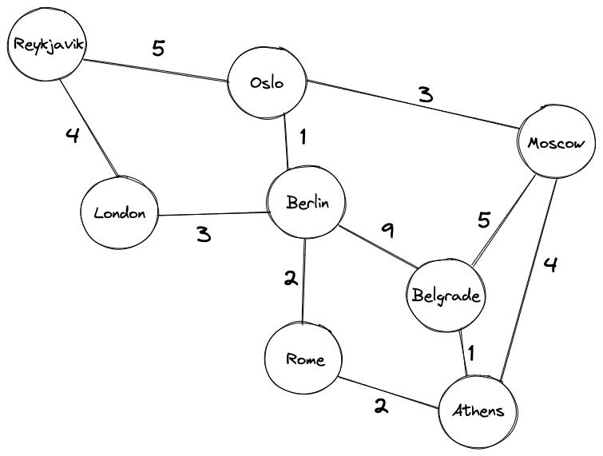
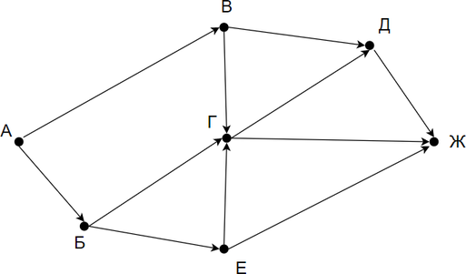

## Уровень 1
1. Что такое граф?
2. Что такое смежные ребра?
3. Какой граф является деревом?
4. Что такое взвешенный направленный граф?
5. Для чего можно применить алгоритм DFS?
6. Что такое топологическая сортировка?
7. Необходимо реализовать на Java такой граф 
8. Решите на бумаге следующую задачу (не надо кодить ее), найти кратчайший маршрут из Рейкявика в Афины 

## Уровень 2
1. Напишите реализацию графа направленного взвешенного графа, под капотом держать двумарный массив (по умолчанию 10 на 10)
   - При добавлении вершины добавляется элемент на пересечении строки и столбца
   - Напишите метод `print()` который будет печатать граф в топологическом порядке
   - добавьте конструктор, который сразу принимает двумерный массив
2. На рисунке — схема дорог, связывающих города А, Б, В, Г, Д, Е, Ж. По каждой дороге можно двигаться только в одном направлении, указанном стрелкой. Сколько существует различных путей из города А в город Ж?

Подсказка: Примените алгоритм BFS или DFS (чутка модифицировав его, так как у нас гарантированно нет циклов)
P.S. На занятии писали Bfs и Dfs для графа, там было условие `alreadyProcessed`(мы добавляли чтобы не зациклиться), если в графе гарантированно нет циклов, то это условие нужно удалить
3. Напишите алгоритм bfs, dfs для графа представленным в виде двумерного массива